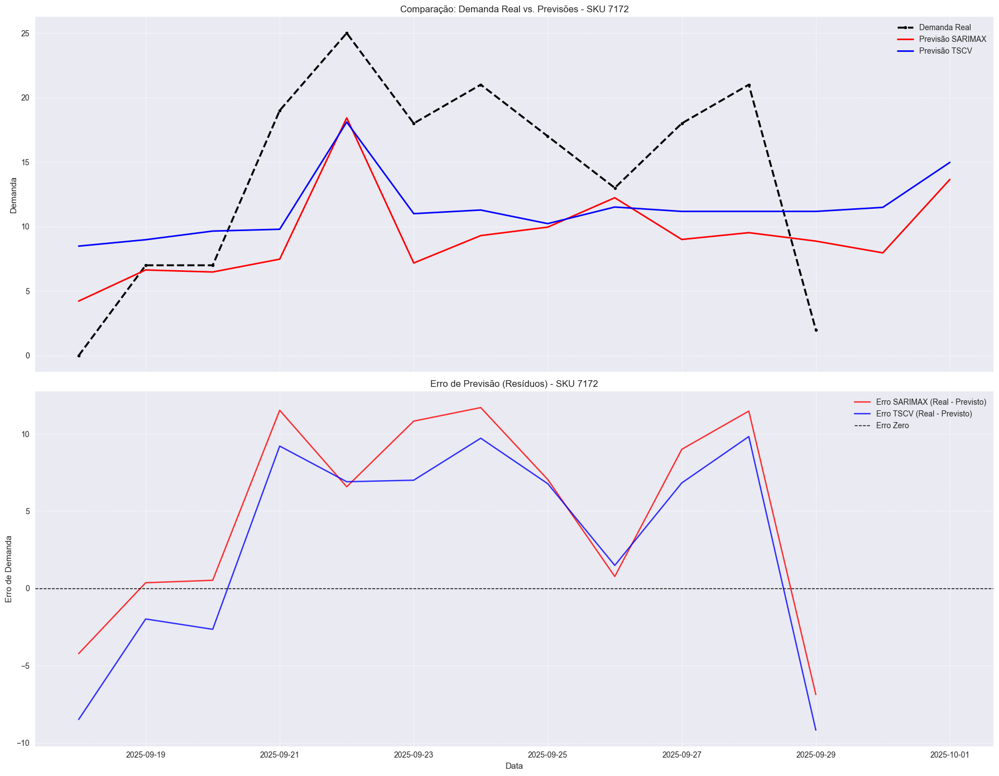
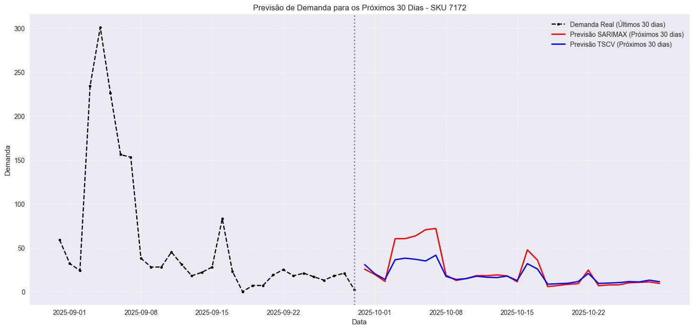

## Objetivo do projeto

Este projeto tem como visão, desenvolver uma ferramenta de previsão de vendas útilizando como variáveis exógenas / Independentes, o preço e outras dummies que dependendo dos resultados de performance, podem ser inclusas no cálculo.

A previsão é feita usando um modelo de validação cruzada em séries temporais e o modelo SARIMAX olhando, a priori, com sazonalidade semanal.

### Premissas

Séries Estacionárias (A base para previsões confiáveis)

Em termos de dados, uma série estacionária é aquela cujas propriedades estatísticas (como média e variância) não mudam ao longo do tempo. Ela não tem tendência de crescimento ou queda.

Por que isso é importante em modelos de séries temporais?

Modelos como o SARIMAX funcionam muito melhor com dados "comportados" (estacionários). O objetivo deles é capturar o relacionamento entre um ponto no tempo e os pontos anteriores. Se a série tem uma forte tendência de crescimento (ex: suas vendas estão dobrando todo mês), o modelo fica "confuso". Ele não consegue aprender o padrão repetitivo, pois a média está sempre mudando.

No projeto a gente faz na função "verificar_estacionariedade" um teste estatístico (ADF) para checar se a série de demanda já é "comportada" ou não.

É aplicado uma transformação matemática simples chamada **diferenciação** (o "I" do ARIMA), que calcula a diferença entre um dia e o anterior. Em vez de prever o valor da venda, o modelo passa a prever a variação da venda, o que geralmente é muito mais estável e estacionário.

### Modelo SARIMAX

O nome pode ser dividido em **SARIMA** (a parte que olha para o tempo) e X (a parte que olha para fatores externos).

ARIMA (p, d, q) -> order=(1, 1, 1) **exemplo do código**

AR de Autoregressivo - p=1: O modelo usa valores passados da própria variável para prever o futuro.

I de integrado - d=1: O processo de diferenciação, tornando a série estacionária.

MA de média móvel - q=1: O modelo olha para os erros de previsão passados para se corrigir.

    Exemplo: Se o modelo previu ontem 100 unidades e a venda real foi 110, ele errou por 10. O componente MA usa esse erro de ontem para ajustar a previsão de hoje.

S de sazonal - 7: Esta é a parte que captura padrões que se repetem em ciclos.

    s=7: Este é o parâmetro mais importante aqui. Ele informa ao modelo que o ciclo sazonal dura 7 dias (uma semana).

    P=1, D=1, Q=1: Funcionam exatamente como os p, d, q minúsculos, mas em vez de comparar com o dia anterior, eles comparam com o mesmo dia no ciclo anterior.

### Validação Cruzada em séries temporais

Validação Cruzada Normal (Errada para o trabalho com séries temporais): Pega todos os seus dados (Janeiro a Dezembro), embaralha tudo e divide em pedaços. O modelo poderia ser treinado com dados de Setembro para prever as vendas de Abril. **Isso é trapaça!**
É como usar o resultado do jogo de amanhã para apostar no jogo de hoje. O modelo "vê o futuro", e o resultado do teste parece ótimo, mas é uma mentira.

Validação Cruzada para Séries Temporais: Respeita a ordem do tempo. O modelo sempre é treinado com dados do passado para prever o futuro. Isso simula como ele vai operar na vida real.

O projeto (FNV_TSCV.py) usa uma técnica chamada TimeSeriesSplit, que é exatamente isso. Pense que estamos fazendo uma série de "simulações de previsão" ao longo do tempo.

Vamos imaginar que você tem 1 ano de dados e seu código está configurado com **n_splits=10.** O que ele faz é o seguinte:

- Simulação 1:

    - **TREINO:** Usa os dados do 1º mês.

    - **TESTE:** Tenta prever os dados do 2º mês.

        *- Guarda o resultado do erro.*

- Simulação 2:

    - **TREINO:** Usa os dados dos meses 1 e 2 (a janela de treino "expandiu").

    - **TESTE:** Tenta prever os dados do 3º mês.

        *- Guarda o resultado do erro.*

- Simulação 3:

    - **TREINO:** Usa os dados dos meses 1, 2 e 3.

    - **TESTE:** Tenta prever os dados do 4º mês.

        *- Guarda o resultado do erro.*

...e assim por diante, por 10 vezes.

No projeto isso se identifica assim:

- **tscv = TimeSeriesSplit(n_splits=10)**

    Tradução: Prepare-se para fazer 10 simulações de previsão, sempre respeitando a ordem do tempo.

- **for fold, (train_idx, test_idx) in enumerate(tscv.split(X)):**

    Tradução: Este é o loop que executa cada uma das 10 simulações. A cada passo, ele pega um pedaço maior de dados para train_idx (passado) e o "próximo" pedaço para test_idx (futuro).

- **model.fit(X_train, y_train) e y_pred = model.predict(X_test)**

    Tradução: Dentro de cada simulação, o modelo é treinado com os dados do passado (X_train) e depois faz as previsões para o futuro (X_test).

- **resultados['rmse'].append(rmse) e resultados['wape'].append(wape)**

    Tradução: Depois de cada simulação, calcule o erro (RMSE, WAPE, etc.) e guarde-o em uma lista.

 - **print(f"   RMSE: {np.mean(resultados['rmse']):.4f} ...")**

    Tradução: No final de todas as 10 simulações, calcule a média de todos os erros que guardamos.

### Aplicação e pipeline

- 1 - Filtrar a lista de produtos que irão ser utilizados para filtra a base de vendas e fazer o treino dos modelos

- 2 - Verifica a estacionariedade dos dados de demandas para a base de venda do produto

- 3 - Aplica as configurações do modelo e executa o FNC_TSCV.py e depois o FNC_SARIMAX.py

- 4 - Agrega os resultados a partir do FNC_Previsoes.py no dataframe de Relatorio_Modelos_Consolidado.csv

### Resultados

#### Previsão x Realizado SKU 7172 com base nos preços do arquivo precos_para_previsoes.xlsx

#### Realizado dos últimos 30 dias e previsão dos próximos 30 dias utilizando o preço de cada dia -30D

